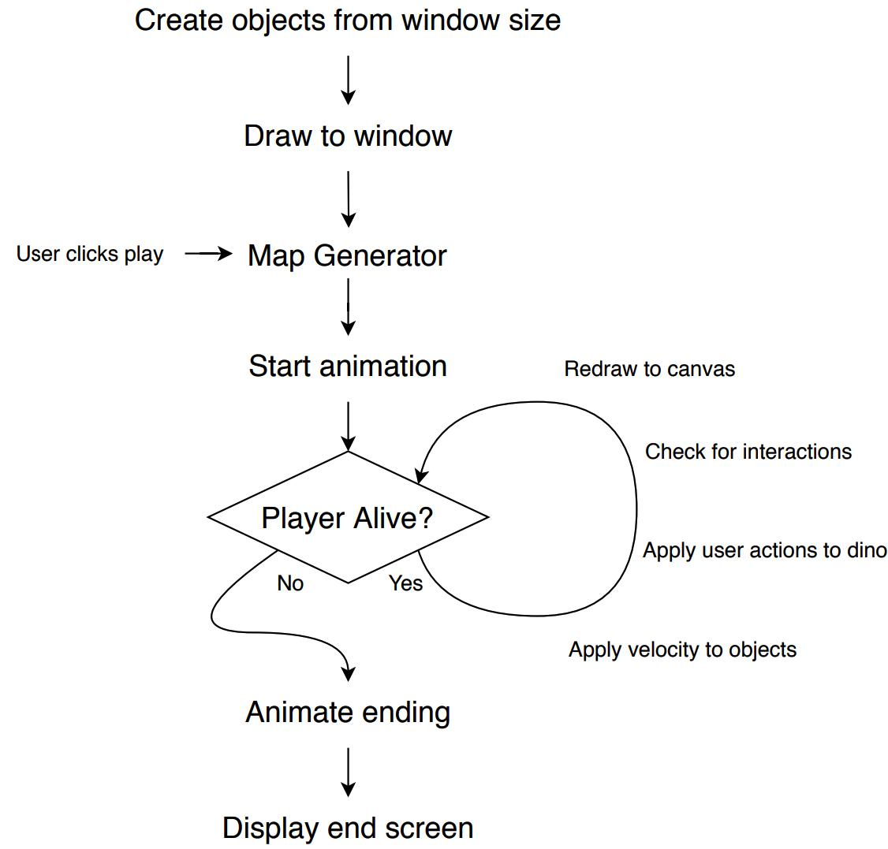

# Dinorun by Technodactyl Studios

Dinorun is a side-scrolling platform game, with auto-generated level from the analysis of a user-provided audio.  
It's built as a Single Page App, with a responsive design and the possibility of playing with the touchscreen on phone or tablet devices.  
The level scores are stored in the database, and the top three for the level played, are displayed on the end screen.


## Getting started

Fork this repo, and clone it to your local machine, then cd to it.

In the command line run:
```bash
bundle
yarn
```

Create a `application.yml` file in the `config` folder, following the provided `example.application.yml` file, replacing user and password placeholders to your PostgreSQL credentials.

Then run:

```bash
rails db:create
rails db:migrate
```

## Usage

To run the app, use `rails s`, then navigate to `http://localhost:3000/`


## Running tests

To run the test use `rspec` from the command line, or launch the app with `rails s`, then navigate to `http://localhost:3000/jasmine`


## Game flow

